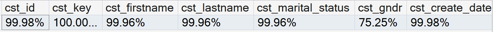
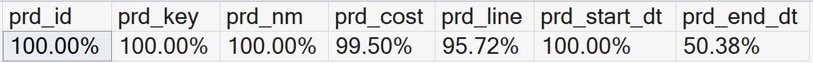
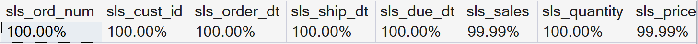
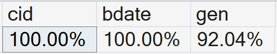
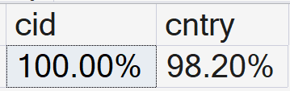
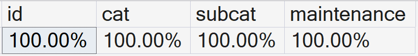

The next table summarize all the data quality problems, according to the
5 dimensions analyzed, founded on the six tables from bronze layer.

::: tabular
\|L2.6cm\|L3cm\|L2.6cm\|L2.6cm\|L2.6cm\|L2.6cm\|L1.5cm\| &
**Completeness** & **Conformity** /\
**Validity** & **Precision** /\
**Accuracy** & **Consistency** & **Uniqueness** /\
**Duplication**\
**crm_cust_info** &
{width="\\linewidth"} &
Duplicated `cst_id`, `cst_key`\

Whitespaces in `cst_firstname`, `cst_lastname` & Outlier date
`cst_create_date = 1900-01-01` & 4 rows with empty columns with
`cst_key` different format &\
**crm_prd_info** &
{width="\\linewidth"} &
& Extreme gap of 8 years in `prd_start_dt`s & Likely some `prd_nm` in
the wrong `prd_line` &\
**crm_sales_details** &
{width="100%"} &
Some `sls_order_dt` values cannot be converted to date\

Negative values present in `sls_sales` and `sls_price` & Only 11 rows
have\
`sls_quantity` $> 1$ & Null `sls_price` correlate with `sls_quantity` &\
**erp_cust_az12** &
{width="100%"} & 9
ambiguous values and 4 empty strings in `erp_cust_az112` & +50-year gap
and future, relative to 2026, in few values of `bdate` & &\
**erp_loc_a101** &
{width="100%"} &
Ambiguous format `cntry`: USA / US / United States; DE / Germany.
Additionally 5 empty strings & & &\
**erp_px_cat_g1v2** &
{width="100%"} & & &
&\
:::
